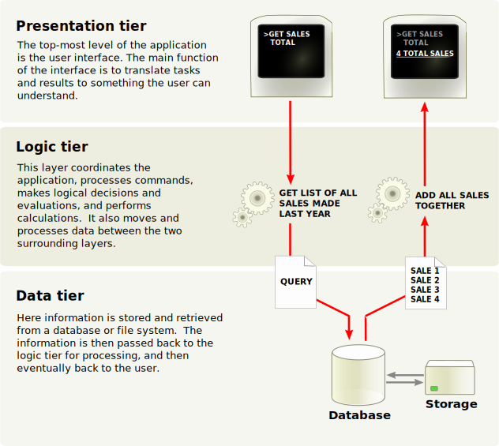

# Where we start

-----
## N-Tiers
<!-- -- class="left" -->

Front 
- Present

Back
- Validate
- Execute

Data
- Persist

Sources : https://en.wikipedia.org/wiki/Multitier_architecture

---
## Some examples
- S.P.A. / Api / Database
- View / Controller / Repository .. Database
- Facade Api / Business Api / Persistance Api .. Database

---
## FullStack
- What does it mean ?

notes: 
- is this because of languages ? Is there a fullheap ?
- is the only way of thinking is in stack ?

-----
## Why it's not enough
- All the calls are directed to the data tiers
- The database, usually a relational one, is hard to scale.
- As the system grows, more and more pressure is added on last tiers : data.

---
- Read & Write needs are often not aligned
  * Write : less volumes / transactions
  * Read : more volumes / optional consistancy / aggregations ...

-----
## SOLUTION

- ADD CACHE !
- OR FIND A BETTER DATABASE !

notes:
This is the end of the show !

-----
## All databases sucks !
- Relational : Hard to scale
- Documents (NoSql) : Hard to query, Hard to update in batchs
- Graph databases : too specialized
- Distributed file system : let's be serious
- Search database (ELK) : too specialized
- Memory database (Redis) : too specialized, let's be serious !

