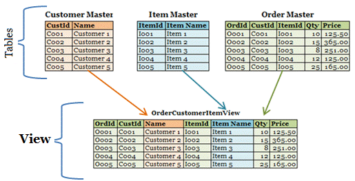
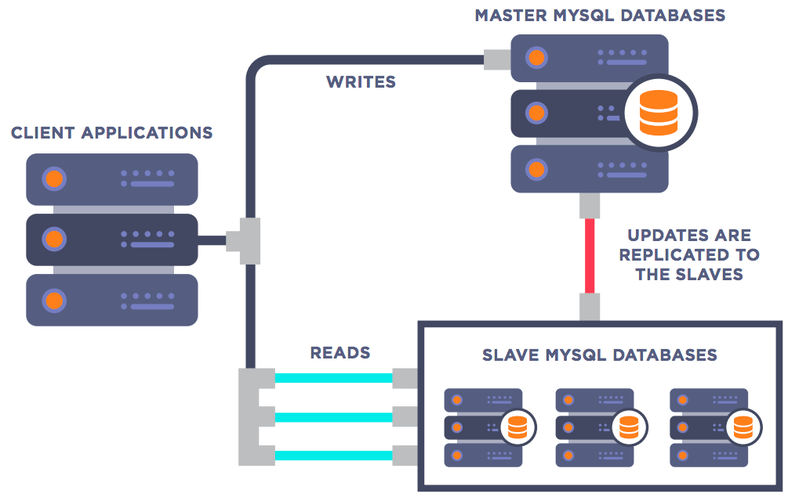

# C.Q.R.S.
### Command & Query Responsibility Segregation

-----
## A Command
- Aim to change the system state
- Can be rejected due to business logic

</br>

## A Query
- Does not change the system state
- Have no business logic

Notes:
# Do not split them and you're good for bad design
 * get_latest API, that erase the latest 
 * get_
 

---
## On a single object
```
    interface IBadIterator
    {
        (bool, object) GetNext();
    }

    interface ICqrsIterator
    {
        object Current { get; }
        bool MoveNext();
    }
``` 

---
## In the data layer
```
// Create, Update, Delete
interface IWriteUserRepository {
    int AddUser(User user);
    void UpdateUser(int userId, User user);
    void RemoveUser(string userId);
}

// Read
interface IReadUserRepository {
    User GetUser(int userId);
    User[] GetUsers(...search parameters...);
}
```

notes:
Do not forget pagination when you return an Array !

---
## In the business layer
```
interface IUserManager {
    int AddUser(User user);
    void MoveUser(int userId, Adress newAdress);
    void ElevateUser(int userId); // make an administrator
    void DeactivateUser(int userId);
    // ...
}

interface IUserSearchService {
    UserData GetUser(int userId);
    UserData[] GetUsers(...search parameters...);
    UserData[] GetAdminUsers(...search parameters...);
    UserData[] GetDeactivatedUsers(...search parameters...);
    bool IsUserAdmin(int userId);
    // ...
}
```

note: 
you can already see that the command/query sementics start to derive.


---
## In a database



note:
Views
- decorelate read usage from the "real" model

---
## In a database - master / mirrors version



note:
- Write only on the master
- Read only on the mirrors

---
### multiple models ?

-----
# How to do it wrong

---
## Double write


---

---
## Log shipping