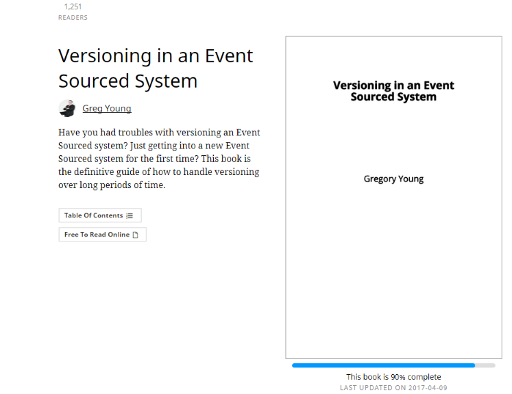

# Event Sourcing

Note:
Event sourcing is just replacing the state database by a log of state mutations 

-----
# An Event
- Represents a state change of the system
- Very carefully named in passed tense
  * Ubiquitous language
  * Don’t be CRUDy
  * Event != Entity 
- Is imutable !

    https://blog.arkency.com/2016/05/the-anatomy-of-domain-event/

note:
Do you a favor : Keep it's structure as simple as you can, you'll have to manage versioning on Events.
ex :
- UserAdressChanged => UserRelocated
- UserRemoved => UserExcluded / UserSubscriptionEnded ...

---

Notes:
- there is no eraser in those pictures.
- erasing or changing is not a thing in some industries (banking for example) => regulation / auditability.
- we do not change the past, same as real world.
- if we fucked up, we correct it by registering some correction event.

-----
## Aggregates & Streams

#### An Aggregate
- Is the business Entity
- has a state
- handle a Command
- produce/emit 0-N Events
- apply those events   to its state

https://thinkbeforecoding.com/post/2014/01/04/Event-Sourcing.-Draw-it

Notes:
The handle/decide method:
- can decide to do nothing
- can decide to return an error
- can have dependencies
- Should never-ever-ever mutate the state !

The apply method:
- mutate the state
- Is pure deterministic function state + event => state
- have **NO** dependencies (not even Datetime.Now)
- Will be called to hydrade the aggregate on the next command handle
- Should never-ever-ever fail !

---
#### A Stream
- Store all events for **1 aggregate**
- In order !

-----
## The Event Store

- is the source of all truth
- has a very simple schema : [StreamId, EventNumber, EventName, EventPayload]
- can be append only, **no update or delete** required
- Store events **in order** for each streams
- Guarantees transaction on a single stream
- Is fast to query on a single stream,
  * in **EventNumber** ascending order,
  * and from a given position/EventNumber.

---
## ES : Bonus points

- should be able to give an aggregated log of all streams 
- great if you can re-partition streams according to projections needs

https://eventstore.org/

-----
## Projections

Notes:

-----
# Super powers ?
some magic now
---
## You can get super specialized read models

---
## You don't loose information

insert cart example

---
## You can plug any projection

- at any time
- so you can answer yes to past needs

---
## Time machine

You can just read the event store up to a point in time

Notes:
You can use it reproduce bugs with the exact state of a aggregate at the time (from production)

---
## Audit for free

The event store is basically a business audit log.

---
<!-- -- class="left" -->
### BDD testing made stupid simple

Given:
- An Aggregate
- Some (mocked) dependencies
- A list of past events

When
- A Command

Then
- A list of Events
- or an Error (and !important **0 events**)

Notes:
At BeezUP we write those tests in yaml documents.

-----
# Can go wrong ?

---
## Eventual consistency

The read model can be late, you have to think about at all the time.

---
## Idempotency / Ordering

Most of the time you'll get events "exactly once".

If you think it's guaranteed, sometimes you'll get "undocumented features". 

Notes:
- what if you receive twice a use get +200 €.
- what if you receive some user change after it gets deleted.
- it's too slow to checkpoints each event.
- you can distribute charge accros multiple consumers, sometimes they can receive the same event.

Multiple strategies :
- save version on the readmodel
- save latest projected event epoch
- don't care !
...
Depending on the targeted read model and business logic !

---
## Split brains

Distinct projections can have distinct delays ...

---
## Versioning events

    https://leanpub.com/esversioning

Notes:
- I'll have the honor to translate it in French !

----- 
## Should you do C.Q.R.S.

YES !

Have it in mind, write & read needs are NOT equals.

-----

## Should you do Event Sourcing

Yes ... ish
- if the domain is your core domain
- if you can turn it into a competitive advantage

But at the very least now you know about it's existence.

Notes:
play spotting CQRS/ES
- When some service can give you aggregated time series in almost real time at large scale 
- on AirBnb => when you edit your flat and then back to the page nothing changed (projection delay)
- on Ingress (the game)
- on LeBonCoin, when your ad have to follow a workflow to be visible

When you have delay on the view : there is some queuing involved.
