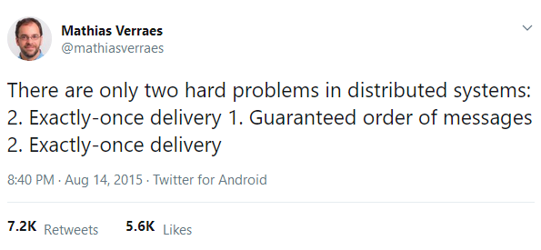

## C.Q.R.S / Event Sourcing

JeUXdiCode - La Rochelle

Jérôme Rouaix - 2019  <!-- .element: class="footer" -->

-----
## #Me
- Jérôme
- 37 years old / half in I.T.
- father since 2016
- Architect at BeezUP
- xp in .net C# / microservices
- less xp in php, js/html/css, rust

----- 
# Summary
---
## N-Tiers
- Fullstack ?                                           <!-- .element: class="fragment" -->
- So the only way of thinking is a stack ?              <!-- .element: class="fragment" -->
- All database sucks !                                  <!-- .element: class="fragment" -->
---
## C.Q.R.S.
- Command & Query Responsibility Segregation            <!-- .element: class="fragment" -->
- Where does it apply                                   <!-- .element: class="fragment" -->
- How to do it wrong ...                                <!-- .element: class="fragment" -->
---
## Event Sourcing
- Store the log, project the state                      <!-- .element: class="fragment" -->
- Magic features / super power for free                 <!-- .element: class="fragment" -->
- Can go wrong ?                                        <!-- .element: class="fragment" -->

-----
# N-Tiers 
-----
## FullStack
- why

-----
# C.Q.R.S.
### Command & Query Responsibility Segregation

-----
# A Command
- Aim to change the system state
- Can be rejected due to business logic

-----
# A Query
- Does no change the system state
- Can be rejected for access control only

-----
# Why separate them ?
- Some example of bad design :
 * get_latest API, that erase the latest 
 * ... 
- 

-----
# Event Sourcing

-----
# What is an Event ?
## an Event : 
- Reprensentes a state change of the system
- Very carefully named in passed tense
  * Ubiquitous language
  * Don’t be CRUDy
  * Event != Entity 
- Is imutable !
???
Do you a favor : Keep it's structure as simple as you can, you'll have to manage versioning on Events.
- ...

.footnote[
https://blog.arkency.com/2016/05/the-anatomy-of-domain-event/
]

-----
# Aggregates & Streams

## An Aggregate
- Is the business Entity
- has a state
- handle a Command
- produce/emit 0-N Events
- apply those events   to its state
- live in memory, no persistence needed

-----
## A Stream
- Store all events for **1 aggregate**

.footnote[
https://thinkbeforecoding.com/post/2014/01/04/Event-Sourcing.-Draw-it
]
???
The handle/decide method:
- can decide to do nothing
- can decide to return an error
- Should never-ever-ever mutate the state !

The apply method:
- Will be called to hydrade the aggregate on the next command handle
- Should never-ever-ever fail !

-----
# Event Store
## the source of all truth
- has a very simple schema : [StreamId, EventNumber, EventName, EventPayload]
- can be append only, **no update or delete** required

- Store events **in order** for each streams
- Guarantees transaction on a single stream
- Is fast to query on a single stream,
  * in **EventNumber** ascending order,
  * and from a given position/EventNumber.

- should be able to give an aggregated log of all streams 
- great if you can re-partition streams according to projections needs
.footnote[https://eventstore.org/]

-----
# Projections

-----
# Can go wrong ?

layout: false
class: center, middle, 
-----
# Sources
## Greg young
https://twitter.com/gregyoung
https://eventstore.org/docs/event-sourcing-basics/index.html
https://www.google.com/search?client=firefox-b-ab&q=Greg+youg+CQRS
## Misc.
https://martinfowler.com/bliki/CQRS.html
https://www.youtube.com/user/erikrozendaal/videos

-----
# Contacts :
- Twitter : @jrouaix

- Github : jrouaix

- Hire : hire@beezup.com

-----
# Credits

Badass Robot :
https://www.deviantart.com/gengoro-akemori/art/fusion-Megatron-Deathstroke-476913009)