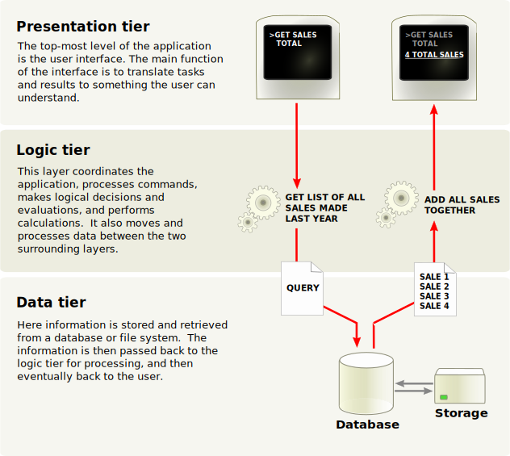

## C.Q.R.S / Event Sourcing

JeUXdiCode - La Rochelle

Jérôme Rouaix - 2019  <!-- .element: class="footer" -->


-----
## #Me
- Jérôme
- 37 years old / half in I.T.
- father since 2016
- Architect at BeezUP
- xp in .net C# / microservices
- less xp in php, js/html/css, rust


----- 
# Summary
---
## Where we start
- N-Tiers                                               <!-- .element: class="fragment" -->
- All databases sucks !                                 <!-- .element: class="fragment" -->
---
## C.Q.R.S.
- Command & Query Responsibility Segregation            <!-- .element: class="fragment" -->
- Where does it apply                                   <!-- .element: class="fragment" -->
- How to do it wrong ...                                <!-- .element: class="fragment" -->
---
## Event Sourcing
- Store the log, project the state                      <!-- .element: class="fragment" -->
- Magic features / super power for free                 <!-- .element: class="fragment" -->
- Can go wrong ?                                        <!-- .element: class="fragment" -->


-----
# Where we start
-----
## N-Tiers
 <!-- -- class="left" -->


Front 
- Present

Back
- Validate
- Execute

Data
- Persist

<div class="footer">
Sources : https://en.wikipedia.org/wiki/Multitier_architecture
</div>


---
## Some examples
- S.P.A. / Api / Database
- View / Controller / Repository .. Database
- Facade Api / Business Api / Persistance Api .. Database


---
## FullStack
- What does it mean ?

notes: 
- is this because of languages ? Is there a fullheap ?
- is the only way of thinking is in stack ?


-----
## Why it's not enough
- All the calls are directed to the database
- The database, usually a relational one, is hard to scale.
- As the system grows, more and more pressure is added on the database

- Read & Write needs are often not aligned
  * Write : less volumes / transactions
  * Read : more volumes / optional consistancy / aggregations ...
 
-----
## SOLUTION

ADD CACHE OR FIND A BETTER DATABASE !

notes:
This is the end of the show !

-----
## All databases sucks !
- Relational : Hard to scale
- Documents (NoSql) : Hard to query, Hard to update in batchs
- Graph databases : too specialized
- Distributed file system : let's be serious
- Search databse (ELK) : too specialized
- Memory database (Redis) : too specialized, let's be serious !


-----
# C.Q.R.S.
### Command & Query Responsibility Segregation

-----
## A Command
- Aim to change the system state
- Can be rejected due to business logic

</br>

## A Query
- Does not change the system state
- Have no business logic

Notes:
# Do not split them and you're good for bad design
 * get_latest API, that erase the latest 
 * get_
 

---
## On a single object
```
    interface IBadIterator
    {
        (bool, object) GetNext();
    }

    interface ICqrsIterator
    {
        object Current { get; }
        bool MoveNext();
    }
``` 

---
## In the data layer
```
// Create, Update, Delete
interface IWriteUserRepository {
    int AddUser(User user);
    void UpdateUser(int userId, User user);
    void RemoveUser(string userId);
}

// Read
interface IReadUserRepository {
    User GetUser(int userId);
    User[] GetUsers(...search parameters...);
}
```

notes:
Do not forget pagination when you return an Array !

---
## In the business layer
```
interface IUserManager {
    int AddUser(User user);
    void MoveUser(int userId, Adress newAdress);
    void ElevateUser(int userId); // make an administrator
    void DeactivateUser(int userId);
    // ...
}

interface IUserSearchService {
    UserData GetUser(int userId);
    UserData[] GetUsers(...search parameters...);
    UserData[] GetAdminUsers(...search parameters...);
    UserData[] GetDeactivatedUsers(...search parameters...);
    bool IsUserAdmin(int userId);
    // ...
}
```

note: 
you can already see that the command/query sementics start to derive.


---
## In a database


note:
Views
- decorelate read usage from the "real" model

---
## In a database - master / mirrors version


note:
- Write only on the master
- Read only on the mirrors

---
### multiple models ?

-----
# How to do it wrong

---
## Double write


---

---
## Log shipping

-----
# Event Sourcing


-----
# What is an Event ?
## an Event : 
- Reprensentes a state change of the system
- Very carefully named in passed tense
  * Ubiquitous language
  * Don’t be CRUDy
  * Event != Entity 
- Is imutable !
???
Do you a favor : Keep it's structure as simple as you can, you'll have to manage versioning on Events.
- ...

.footnote[
https://blog.arkency.com/2016/05/the-anatomy-of-domain-event/
]


-----
# Aggregates & Streams

## An Aggregate
- Is the business Entity
- has a state
- handle a Command
- produce/emit 0-N Events
- apply those events <br/> to its state
- live in memory, no persistence needed

-----
## A Stream
- Store all events for **1 aggregate**


.footnote[
https://thinkbeforecoding.com/post/2014/01/04/Event-Sourcing.-Draw-it
]
???
The handle/decide method:
- can decide to do nothing
- can decide to return an error
- Should never-ever-ever mutate the state !

The apply method:
- Will be called to hydrade the aggregate on the next command handle
- Should never-ever-ever fail !


-----
# Event Store
## the source of all truth
- has a very simple schema : [StreamId, EventNumber, EventName, EventPayload]
- can be append only, **no update or delete** required


- Store events **in order** for each streams
- Guarantees transaction on a single stream
- Is fast to query on a single stream,
  * in **EventNumber** ascending order,
  * and from a given position/EventNumber.


- should be able to give an aggregated log of all streams 
- great if you can re-partition streams according to projections needs
.footnote[https://eventstore.org/]


-----
# Projections


-----
# Can go wrong ?


----- 
## Should you do C.Q.R.S.

----- 
## Should you do Event Sourcing

-----
# Sources
## Greg young
https://twitter.com/gregyoung
https://eventstore.org/docs/event-sourcing-basics/index.html
https://www.google.com/search?client=firefox-b-ab&q=Greg+youg+CQRS
## Misc.
https://martinfowler.com/bliki/CQRS.html
https://www.youtube.com/user/erikrozendaal/videos


-----
# Contacts :
- Twitter : @jrouaix

- Github : jrouaix

- Hire : hire@beezup.com

-----
# Credits

Badass Robot :
https://www.deviantart.com/gengoro-akemori/art/fusion-Megatron-Deathstroke-476913009)